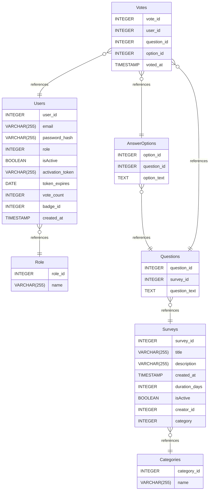

# Untitled Diagram documentation
## Summary

- [Introduction](#introduction)
- [Database Type](#database-type)
- [Table Structure](#table-structure)
	- [Users](#users)
	- [Role](#role)
	- [Categories](#categories)
	- [Surveys](#surveys)
	- [Questions](#questions)
	- [AnswerOptions](#answeroptions)
	- [Votes](#votes)
- [Relationships](#relationships)
- [Database Diagram](#database-diagram)

## Introduction

## Database type

- **Database system:** PostgreSQL
## Table structure

### Users

| Name        | Type          | Settings                      | References                    | Note                           |
|-------------|---------------|-------------------------------|-------------------------------|--------------------------------|
| **user_id** | INTEGER | 🔑 PK, not null, unique, autoincrement |  | |
| **email** | VARCHAR(255) | null |  | |
| **password_hash** | VARCHAR(255) | null |  | |
| **role** | INTEGER | null | fk_Users_role_Role | |
| **isActive** | BOOLEAN | null |  | |
| **activation_token** | VARCHAR(255) | null |  | |
| **token_expires** | DATE | null |  | |
| **vote_count** | INTEGER | null |  | |
| **badge_id** | INTEGER | null |  | |
| **created_at** | TIMESTAMP | null |  | | 

### Role

| Name        | Type          | Settings                      | References                    | Note                           |
|-------------|---------------|-------------------------------|-------------------------------|--------------------------------|
| **role_id** | INTEGER | 🔑 PK, not null, unique, autoincrement |  | |
| **name** | VARCHAR(255) | null |  | | 

### Categories

| Name        | Type          | Settings                      | References                    | Note                           |
|-------------|---------------|-------------------------------|-------------------------------|--------------------------------|
| **category_id** | INTEGER | 🔑 PK, not null, unique, autoincrement |  | |
| **name** | VARCHAR(255) | null |  | | 

### Surveys

| Name        | Type          | Settings                      | References                    | Note                           |
|-------------|---------------|-------------------------------|-------------------------------|--------------------------------|
| **survey_id** | INTEGER | 🔑 PK, not null, unique, autoincrement |  | |
| **title** | VARCHAR(255) | null |  | |
| **description** | VARCHAR(255) | null |  | |
| **created_at** | TIMESTAMP | null |  | |
| **duration_days** | INTEGER | null |  | |
| **isActive** | BOOLEAN | null |  | |
| **creator_id** | INTEGER | null |  | |
| **category** | INTEGER | null | fk_Surveys_category_Categories | | 

### Questions

| Name        | Type          | Settings                      | References                    | Note                           |
|-------------|---------------|-------------------------------|-------------------------------|--------------------------------|
| **question_id** | INTEGER | 🔑 PK, not null, unique, autoincrement |  | |
| **survey_id** | INTEGER | null | fk_Questions_survey_id_Surveys | |
| **question_text** | TEXT | null |  | | 

### AnswerOptions

| Name        | Type          | Settings                      | References                    | Note                           |
|-------------|---------------|-------------------------------|-------------------------------|--------------------------------|
| **option_id** | INTEGER | 🔑 PK, not null, unique, autoincrement |  | |
| **question_id** | INTEGER | null | fk_AnswerOptions_question_id_Questions | |
| **option_text** | TEXT | null |  | | 

### Votes

| Name        | Type          | Settings                      | References                    | Note                           |
|-------------|---------------|-------------------------------|-------------------------------|--------------------------------|
| **vote_id** | INTEGER | 🔑 PK, not null, unique, autoincrement |  | |
| **user_id** | INTEGER | null | fk_Votes_user_id_Users | |
| **question_id** | INTEGER | null | fk_Votes_question_id_Questions | |
| **option_id** | INTEGER | null | fk_Votes_option_id_AnswerOptions | |
| **voted_at** | TIMESTAMP | null |  | | 

## Relationships

- **Users to Role**: many_to_one
- **Surveys to Categories**: many_to_one
- **Questions to Surveys**: many_to_one
- **AnswerOptions to Questions**: many_to_one
- **Votes to AnswerOptions**: many_to_one
- **Votes to Questions**: many_to_one
- **Votes to Users**: many_to_one

## Database Diagram

